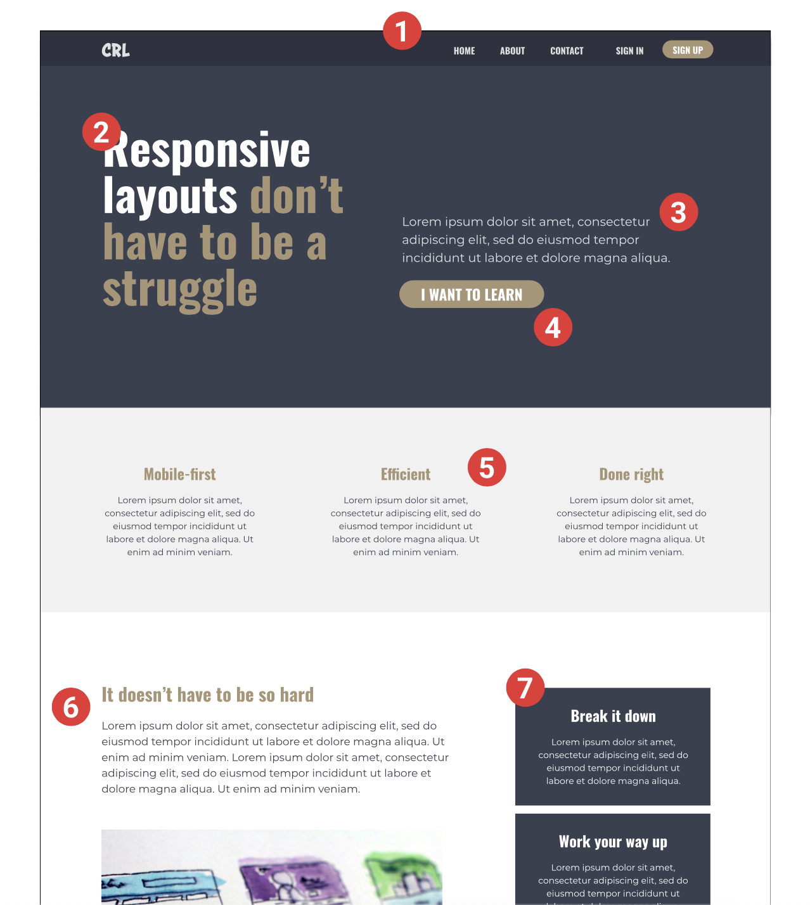

# Conquering Responsive Layouts - Final Challenge

This is a solution to the Final Challenge for a Conquering Responsive Layouts course I took.  The course focused on mobile first production and utilizing CSS to create responsive websites.

## Table of contents

- [Overview](#overview)
  - [The challenge](#the-challenge)
  - [Screenshot](#screenshot)
  - [Links](#links)
- [My process](#my-process)
  - [Built with](#built-with)
  - [What I learned](#what-i-learned)
  - [Continued development](#continued-development)
- [Author](#author)

## Overview

### The challenge

-Recreate Website design from scratch.
-Website should be fully responsive.
-Website should utilize 2 breakpoints at 700px and 1000px to change layout.

### Screenshot

### Links

- Live Site URL: [Live Demo]()

## My process

### Built with

- Semantic HTML5 markup
- CSS custom properties
- Flexbox
- Vanilla JS

### What I learned

Throughout the course I learned several tips and tricks to create more responsive websites and a better user experience.  This final project included all concepts learned in the course and was fun challenge that improved my coding skills. 

### Continued development

I plan to incorporate things I learned in this course to all future projects of mine that will be used on multiple devices.

## Author

- Website - [Connor Henn](https://www.connorhenn.dev)
